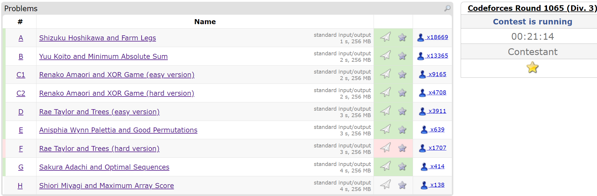
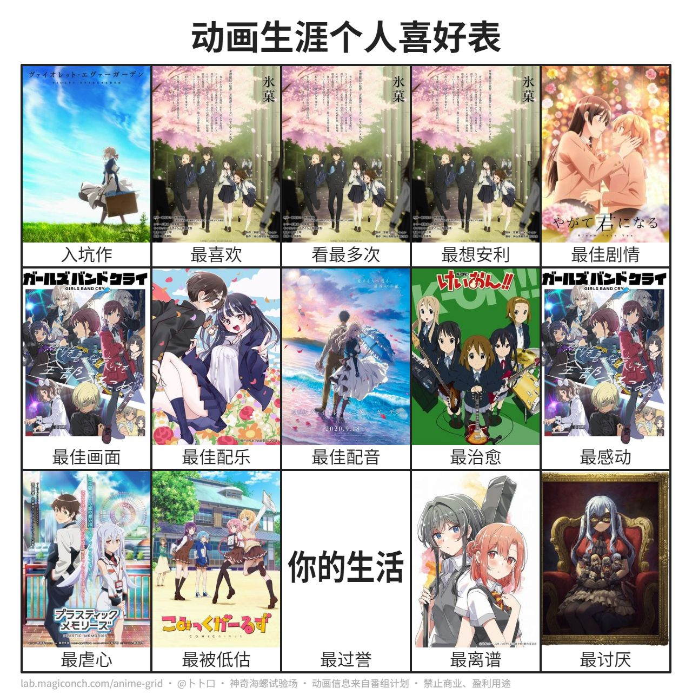

# 我与我周旋久

>写这篇文章时我还未满二十，但是考虑到接下来的种种任务压力，我在一个普通的周一翘了算法课来给自己提前写下生日祝福和上大学接近两年半来的一个小总结

  <svg viewBox="0 0 1200 160" width="100%" xmlns="http://www.w3.org/2000/svg">
    <rect width="1200" height="160" rx="6" fill="black" stroke="#333" stroke-width="2"/>
    <text
      x="36"
      y="96"
      fill="#39ff14"
      font-size="38"
      font-family="Courier New, Consolas, monospace">
      &gt; 祝我生日快乐_
    </text>
  </svg>

我想上大学确确实实非常深刻的改变了我，不管是三观还是能力上，世界在我眼里被解构的越发荒谬，人的行为渐渐无迹可循，专业与现实的冲击越发强烈(像极了一对苦命鸳鸯，，，)，常常对自己所做的一切事情发出“这有意义吗”的疑问，但往往想到了最后不过是那一句：

>我与我周旋久，宁作我

但是不管怎么样，总还是有些盼头值得我多活一会(但是GSZM快把我的Live毁了)，下面就记录和总结一下我这两年半大学生活的一些收获

内容主要围绕下面几点展开，大都是一些我困扰了比较久的问题

- [x] 技术的更迭
- [x] 关系的维护
- [x] 学习的策略
- [x] 动漫的乐趣
- [x] 生命的意义

## 技术的更迭

说到技术，即便是不了解CS/DS的人也会提起AI(Artificial Intelligence)，这个词在我看来已经有点浮躁和不准确了，像是Python中的装饰器滥用一样，一定要将它与其他的领域结合，否则就说明那个领域的贬值

由于该领域(与其说是AI倒不如直接说是LLM)在当今社会过于重要，产品常常会迎来对比，就犹如最新的饭圈一样：“哈基米天下第一”，“Deepseek是我爹”，“GPT吊打一切”，“Claude代码乱杀”，诸如此类的话已经十分广泛。斗法也不仅是在业界，国家之间的大模型自研能力也经常被拿出来对比，最经典的就是Deepseek秒杀一切或者美帝闭源大模型薄纱国产，下面我想写一些我的观察和思考：

### Deepseek的兴起

年初的Deepseek(或者说去年，但是为人所熟知是今年年初)无疑是给了国产大模型一个强心剂，极低的成本，极好的效果，可以说是革命性的成果(zero to one)，它的效果在起码R1刚发布时绝对是SOTA级别，必须承认其的“历史地位”

### 三巨头的轮番崛起

然后就是美帝的几大闭源/开源模型，你方唱罢我登场，GPT-5、Gemini2.5pro、Grok4、Sora2、Claude(这个审核较严我未使用)——

个人更喜欢Gemini2.5一点，对于数学问题的处理能力在我这里是最好的

### Gemini3登顶

然后就是今年年末所推出的Gemini3模型，单单从我个人的使用体验上，它完爆了我之前用过的所有模型，几乎没有幻觉，对于要求很好的执行，可以直接复制markdown和latex，极大方便了一个喜欢使用$\LaTeX$写作业的统计学鼠鼠(甚至能帮助我科研)

更厉害的应该是它有很好的项目构建功能(我使用过Trae CN，功能还是不错的，但是我觉得远远不如能够集成Gemini3的效果)，我提一个要求它就能够自我挖掘出更多的点，创建可视化页面和简单项目，如果未来能够无限token集成到国内能够方便使用的AI IDE我认为会非常强大(做梦中，白嫖还是不如付费)

> [!tip] 对于国产模型的一点期许
> 希望能开发出类似Cursor一样强大的AI IDE、Claude一样强大的代码LLM、Gemini3一样强的用于文字撰写和帮助科研的LLM

### 技术反思

然后就是对于我自己技术的一些反思：

- [x] Python/R的能力有很大的提高
- [x] 算法能力的长进
- [x] 对于HTML/CSS/JS的基本认识
- [x] 使用Jupyter Notebook进行DL复现
- [x] 对于Linux系统有了一些基本的了解

比较大的问题应该是对于Python中的一些开发特性和用法不熟悉，比如怎么去安排输入输出，内核使用，Numpy和Pandas等库的用法如何优化，手搓代码的能力还是比较弱

未来考虑将自己的笔记本电脑变成完全的Linux(Arch/Nix/Fedora)，以便于我后续的开发工作(Windows太卡了，因为电脑也比较便宜所以老是卡)

### 我的工具链

我目前主要使用的AI工具是下面这些：

+ [x] Gemini3(or higher)
+ [x] Trae CN(AI IDE)/Cursor
+ [x] VSCode + Copilot
+ [x] GPT5.1(文字处理)
+ [x] Grok4(创作R18内容)

我还想写一些平台方面的收获来给我的摆烂找一些借口(我还是做了一些工作的)：

1. Codeforces 一个单纯用来打比赛的网站，但是我感觉单纯就业向还是算了，力扣牛客会是更好的选择
2. Kaggle 数据科学的网站 有免费的GPU额度而且使用Notebook来进行训练
3. Leetcode 谁能拒绝夏令营/找工作的时候能秒杀Hot100/面试常考200的人啊！！！
4. Atcoder/洛谷 也是打比赛和写算法题用的(我个人觉得只需要Leetcode和Codeforces/Atcoder)搭配即可

这是最近的一次CF比赛，我认为我发挥的很好！(赌上百合骑士荣耀的AC！)，但是忘记自己还不是受信用户打完了发现没加Rating

既然是生日还是可以许愿的吧：

**希望我Rating上2000！！！**

希望二十岁的我能够有更坚实的代码基础和手搓能力()

## 关系的维护

伴随年龄增长，我发现如果说自己是高密度的恒星，周围的人更多的像是偶尔经过轨道的小行星，无法被捕获，目前真正能够说很融洽的朋友大概也只有十个不到？不过我想这也是相当合理的，不然人际交往一定会影响我的正常生活。

>这个数量有社会心理学的Dunbar's number支撑

但是从我的日常生活入手进行反演可以很自然的得到“这个人的一天不需要其他人干预”的结论，因此我想这也不是太坏的事情。自从明确了自己的目标之后，与其他人的关系就变得极其简单了(co-worker)，这种生活模式能够很好的避免期待落差效应，直接将生活变为极简。并且我也不打算找伴侣因此应该也没有经济压力和对方家庭的压力，只需要自己推进生活和工作即可，我想我目前是很自洽的状态(Work Life Balance!)

## 学习的策略

### 保研

>直博还是学硕？这是一个问题

明年应该就是我的保研季了，我目前大概已经有了想去的地方，希望能够顺利上岸(我的目标定的不算高，应该是可以实现的low hanging fruit)，努力了三年的GPA换得一张保研截图真是大学期间性价比很低的投资(我越来越这么觉得)

### 愚蠢的考试

我想我最大的有关成绩的教训有那么几个：

- [x] 考试应该面向题目而不是知识
- [x] 成绩与学的好坏无关
- [x] 不要因为成绩而悲伤

从大二转专业结束后的每一次月考，战战兢兢，每次考不好总是会EMO很久，到中途常常放弃治疗缩在宿舍里，再到最后总是释怀的似了，包括大二下最重要的一些课程没有拿到理想的成绩(很伤心)

有时候考试真的不是很依赖于你学习的成果而是针对你能否准确把握老师在考试前提前释放的信号从而提前准备，比如面向作业，面向往年题的复习往往比面向知识更加有效，相应的这也造就了很多的机会主义者。比如我认为大多数人实际上对于知识的掌握应该是依概率收敛于0的，但是他们能够拿到在七十八十左右的分数，我想这也是考试体制被破坏的结果(老师不愿意创新出新题，绝大多数的课程也就是念PPT/课本)

> [!cite] 辱骂
> 我无法想象为什么那么多理工科的学生快毕业了连矩阵的运算性质都不清楚，为什么Github都没打开过，只会使用B站看那些其实精简过的念书课程会觉得如获珍宝(我还是不明白为甚么有人觉得B站的某些教程好)，简直是Face都不要了！那些课程(不客气的说基本都是国内的)质量相当低下，内容要么很简单(Copy the book and read it)，要么就是完完全全的面向考试没有一点理论(没有意思)

### 我的学习

这么多年的经验告诉我对于我来说最合适的学习手段就是面向书本自己学习，因为我不希望我的学习受到别人的约束(最起码第一遍学习某个知识的时候总是自己先学会的，或者说预习)，别人的讲述会干扰我的思考，我有一种天生的怀疑一切的天性(很多人说是杠)，因此老师的讲述我往往也只会当作参考，然后试图去证伪或是证明，这一过程中我会完成我的学习，从而迭代出自己的思想，这也是我上大学以来琢磨出的比较适合我的做法，并且基于这种思想使得我笔记系统的构成在这将近三年来也有了比较大的改进

> [!tip] 抄书
> 大多数理工科学生笔记等于就是抄书，即使是只将叙述性的语句删去，例子删去，剩下的精简化的笔记都少之又少，更多的是一字不改的直接抄写，这种方法能流传这么久显然也有它的道理，但是我觉得这并不是比较优的算法。
> 
> 我个人的经验也告诉我这已经是一种下限较高的方法，你通过抄书快速熟悉内容，在抄写的过程中有所领悟是相当自然的，如果能够针对某个点进行深挖然后得出一系列的结果，不同的视角去印证自然是更好的。
> 
> 抄书的原因在我看来就是对于所学习的内容还不是很了解，无法很好的去用一套体系的理论去涵盖它，不清楚它所在的位置，因此最简单的处理手段就是沿用教科书的结构，所以很自然就会演变成抄书——所以避免抄书就得先学会你所抄写的内容(这似乎有一些矛盾)，然后用你自己的想法去组织他们，改变他们的排布之后自然会发现原本排布的优劣，也就能够理解作者的苦心(或者作者是个sb的事实)
> 
> 我心中比较良好的办法是根据自己的理解先沿用架构去优化的抄书，然后再学完之后再返回去返工一次，迭代升级，增加新的内容，或者学后续课程的时候再返回去补充原本的底层内容(例如学习实变、泛函就可以帮助数学分析的学习)

我比较满意的其实是我的实变函数笔记，当时确实比较多的去思考了很多问题，成熟度变得比较好了一些，可惜没有完成，最后搁置在Obsidain的仓库中没有发布

参加讨论班我也不知道有什么意义，主讲或许对于那块内容很熟悉但是听众有时不得不忍受非常糟糕的Lecturer(这种角色有时候是我)，这个传统我也不知道怎么来的，如果是有老师介入(或者说学习过这门课程的人)，然后让初学者快速学会去讲，一群正常人不停的发问，可能效率确实还可以(差距大概就是在自己看书的时候玩手机和掉入一些逻辑陷阱的时间可以省下来)

> [!warning] 声明
> 这不能成为你翘掉组会去玩的理由

对于每一个靠自学学习知识的人，我认为做题都是必要的，因为没有其他更方便的办法去检验自己学习的成果，而且习题是另一种学到知识的手段，很多作者甚至会将重要的结论和技巧藏在习题里(有时候还有open problem需要注意)，做习题是将理论和实践联系的重要方法

> [!cite] 做题区
> 很多数学类的同学会被归类为做题区，主要是因为日常生活中以做题作为一种自信的资本，将做题视作了一种精神胜利法，并且眼高于顶，这种被归类为普通做题区。但是也有偏激的白痴将做习题视作一种可耻的手段，看到做习题就嘲笑的多半是因为自己水平不佳，时间过多只好浪费在网络对线上——

## 动漫的乐趣

> [!tip] 纯主观叠甲
> 很多自己眼中的神作在另一些人眼里并不算神作是非常正常的情况

先贴一个我心中的一个动漫榜单吧，也可以访问我的[二次元板块](https://www.eurekaimer.xyz/%E4%BA%8C%E6%AC%A1%E5%85%83/%E4%BA%8C%E6%AC%A1%E5%85%83/)：

### 从京都开始的入宅

我应该是从看到了紫罗兰永恒花园中细腻的作画和饱满的情感表达受到震撼之后进入的二次元，然后高中接触了冰菓小说再观看了很多遍动画(坦白来说我觉得改的非常好)，然后大概在大一的暑假受到一位学弟的推荐观看了轻音少女，后面在研究女女关系性和山田监督的人生经历和作品集之后垂直入坑真百合。

> [!tip] 京都
> 可以看到我前期看过的大多数作品都是京都创作的，它成功的养刁了我对作画细致的要求，对于一些很经典的番剧我就因为画风原因有些不能接受了(巨人、JOJO等)

***再次为京阿尼大火中丧生的人们默哀...***

### 从柑橘味开始的真百合

柑橘味香气应该可以说是我看的第一部真百合动画，单从剧情来说远不如漫画，作画还是有崩坏的地方，而且刚开始着实给我吓了一跳(不剧透)，但是出于历史地位还是给与偏爱了，还是有一些可取之处和名言的。

从柑橘味开始我看了很多相当著名的百合番(业内)，对于百合的认识大概停留在女孩子的甜甜恋爱层面，但是对于其中爱的含义还是按照传统的观点去看待的，直到一部真正伟大的作品改变了我原本对于爱的看法

### 从终将开始的爱的思考

终将成为你必将是我心中一部无法磨灭的作品，无论是剧情、作画、配音、内核、音乐都是顶满的，对于一个会爱上 不爱上任何人的小系侑 的七海灯子如何理解，对于佐伯女士的理解，对于不敢承认自己的爱的小系侑的理解，这是一个非常值得思考的问题——

> [!cite] 最喜欢的作品
> 在没有接触周次之前，我最喜欢的百合作品一定是终将成为你(动画)或者是入间的安达与岛村(小说)，但是周次实在是太细腻了！而且扭曲感和一些病态的占有准确的戳中我的好球区

### 百合的内涵

可以说百合是我上大学以来最大的一个额外收获，很长一段时间里，我每天唯一的消遣就是看着那些小说和漫画，我认为对于我而言这是一种很好的排遣负面情绪的方法，但是目前圈内的环境并不是特别好，还是得专注于作品

对于我来说入门的百合作品如果以轻百合开始显然应该是轻音少女，之前看孤独摇滚并没有特别在意(其实对于我来说我并不是很吃滚)，然后从柑橘味香气入坑，樱trick，终将成为你等等，最后因为百合动画太过于抽象只好转战小说和漫画区(混迹于百合会中)，也找到了不错的百合作品(一位老师写的骨科百)，加了读者群之后交到了一些朋友也碰见一些抽象人(不好说，哪里都有抽象人)

总的来说大概最为经典和喜爱的作品是下面这些(有时间应该都会二刷的)：

- [x] 周次[400]
- [x] 安达与岛村(入间好像又犯病了)
- [x] 终将成为你(稳定发挥)

## 生命的意义

正如那个荒谬大师加缪说的：“自杀是唯一值得讨论的命题”，我现在越来越有所体会了，生命是我目前完全没有头绪的事情，它如何发生？我为什么是我？我为什么有意识？这些我都不能回答，所以选择自己结束生命显然是值得讨论的，我们这些人或许只是在沿着某些宽松的约束行进在被划定的轨道上。

因此我时常怀疑这个宇宙的目的——